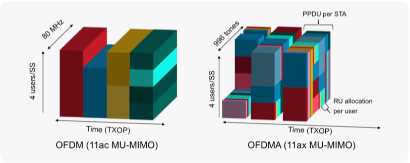

# The new features in Wi-Fi 6 (2)

The challenges that we encounter in improving performance in the previous page can be resolved by enhancing **airtime efficiency**.

## Resource allocation
Wi-Fi 6 chooses to use **OFDMA** instead of OFDM of Wi-Fi 5. The difference between two modulation schemes is the resource allocation for multi-users. You can simply think the multi-user version of OFDM is OFDMA. 
In OFDM, multiple users are seperated by only space(spatial streams) and time, not by frequency. OFDMA adds a third multi-user dimension, frequency or data tone. Like in the below picutre, OFDMA diagram(the right one) is also divided on z-axis. OFDM cannot allot each channel to multi-users, whereas OFDMA is able to allot each subcarrier to different users.

This feature brings many advantages to Wi-Fi 6. In a high-density environment, if there is a client who uses only small amount of data traffic, OFDM wastes most of the bandwidth of the channel assigned to the client. But OFDMA can utilize the spare bandwidth for other clients, keeping its throughput high with many users. (The other advantage)

## Improving capacity
It is a challenge to overcome the interference in the environment sharing the same channel bandwidth in the same physical space. This happends in the mobile enviroment in a large place sharing APs. A client should decide which an AP it will connect among several APs, or which *Basic Service Set(BSS))* it should be in. BSS is a set of clients connected to an AP. In the situation that a client is the middle of two BSSs, or Aps, the client also hear the traffic from overlapping BSS(OBSS). This can cause the OBSS interference.

Wi-Fi 6 introduces BSS(Basic Service Set) Coloring, a method to differentiate between BSSs. BSS coloring is the way to differenticate BSS in the same channel by BSS number(color) in the PHY header. So clients can ignore the traffic not from connected AP. This also improves the battery life.

## Flexible low-power device scheduling
This section is not directly related with airtime efficiency, but about a power-saving mode. The prior versions of Wi-Fi has some kinds of low-power mode like Unscheduled Automatic Power Save Delivery (U-APSD). But a low-power device should wake up periodically to receive beacons generally generally a multiple of every 102.4 ms. This periodic listening to beacons restricts potential energy-saving.
Wi-Fi 6 introdcues the new power-savings mode called **Target-Wakeup Time (TWT)**. A devices, or a stations(STA) can schedule any length of sleeping time up to 5 years. This will help many small IoT devices to save their energy.

