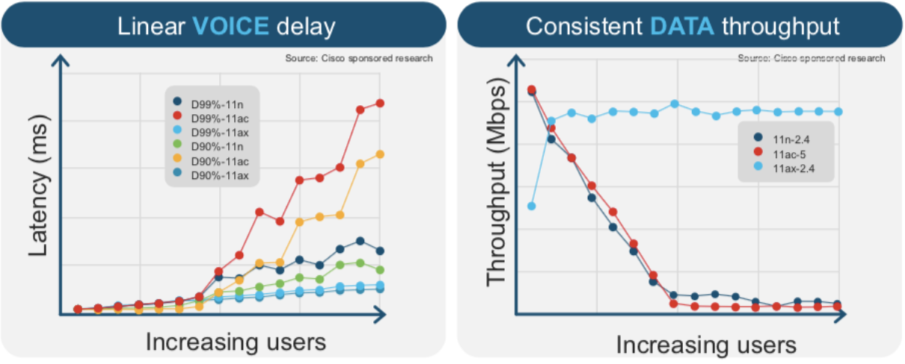

# How Wi-Fi 6 will change business and industry
## Industrial advantages of Wi-Fi 6
#### speed
Wi-Fi 6 provides a maximum speed of 4.8Gbps on an 80 MHz channel using 8×8 MIMO, while Wi-Fi 5 shows the maximum speed of 3.5Gps in the same condition. It is about 40% faster.

#### high density
Wi-Fi 6 takes its strenth on especially high-density environments. With OFDMA, it can efficiently allocate the bandwidth resource to multi-users. As a result, it shows the consistent throughput and low latency, unlike the prior versions as you can see in the below graph.

#### low-power device
Wi-Fi 6 has many features to save energy usage like TWT, BSS Coloring. This can save energy usage in IoT devices which have limited battery and computation resource.

#### range
Wi-Fi 6 delivers longer range than previous versions as the below graph.
Clients can have the same quality connection at a longer distance.

#### compatibility
You don't need to worry about compatibility. A Wi-Fi 6 device must support all modes of Wi-Fi. A Wi-Fi 6 access point can also communicate with the previous version of Wi-Fi devices. So Wi-Fi 6 can co-exist with the previous versions rather than changing existing devices. But the prior version of devices can't take the advantages of Wi-Fi 6.
